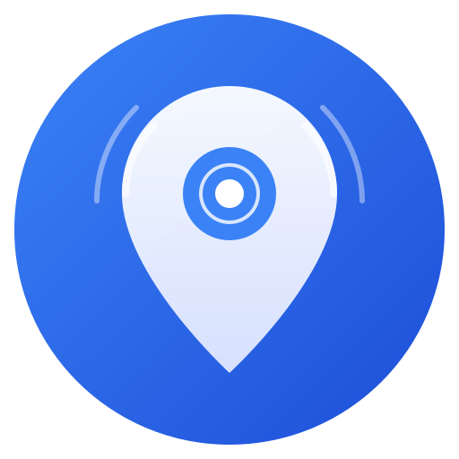

<p align="center">
  
</p>

<h1 align="center">FindMe</h1>

<p align="center">
  <strong>Self-hosted, privacy-first location sharing for families and teams.</strong><br/>
  Your data stays on your server. No third-party tracking. No analytics.
</p>

<p align="center">
  <a href="#install">Install</a> &bull;
  <a href="#features">Features</a> &bull;
  <a href="#mobile-app">Mobile App</a> &bull;
  <a href="#configuration">Configuration</a> &bull;
  <a href="#contributing">Contributing</a>
</p>

---

## Install

Pull and run the pre-built Docker image — works on amd64 and arm64 (Raspberry Pi, Apple Silicon, etc.):

```bash
mkdir findme && cd findme

# Download the compose file
curl -O https://raw.githubusercontent.com/bjoernch/FindMe/main/findme/docker-compose.yml

# Start FindMe
docker compose up -d
```

That's it. Open `http://your-server:3000` — the first user to register becomes admin.

> **Reverse proxy?** FindMe listens on port 3000. Point your existing proxy (Nginx Proxy Manager, Traefik, Caddy, etc.) to `http://localhost:3000`. See the [docker-compose.yml](findme/docker-compose.yml) for optional built-in Caddy and PostgreSQL configs.

### Generating secrets

For production, set proper secrets in a `.env` file next to your `docker-compose.yml`:

```bash
cat > .env << 'EOF'
NEXTAUTH_SECRET=$(openssl rand -base64 32)
JWT_SECRET=$(openssl rand -base64 32)
NEXTAUTH_URL=https://findme.yourdomain.com
FINDME_PUBLIC_URL=https://findme.yourdomain.com
EOF
```

## Features

- **Live map** — Real-time positions via SSE, multiple map styles (street, satellite, dark, topo)
- **People sharing** — Invite-based mutual location sharing between users
- **Temporary share links** — Time-limited public location links (1h, 24h, 7d, or permanent)
- **Geofencing** — Enter/exit alerts via push and email
- **Location history** — View tracks with trip stats (distance, speed, elevation), export as GPX or CSV
- **Push notifications** — Configurable per-user preferences with quiet hours
- **Offline mode** — Mobile app caches data and queues location updates when offline
- **Passkey auth** — Passwordless login with WebAuthn/FIDO2
- **QR code pairing** — Scan a code from the web dashboard to pair your phone
- **Admin panel** — User management, password resets, device overview, SMTP settings
- **Dark mode** — System/light/dark on both web and mobile
- **Docker ready** — Single-command deploy, multi-arch image, structured logging

## Tech Stack

| Layer | Technology |
|-------|-----------|
| Server | Next.js 16, React 19, TypeScript |
| Database | SQLite (default) or PostgreSQL |
| ORM | Prisma |
| Auth | NextAuth.js v5 + JWT + WebAuthn |
| Mobile | React Native (Expo) |
| Maps | Leaflet |
| Real-time | Server-Sent Events (SSE) |
| Push | Expo Push Notifications |
| CI/CD | GitHub Actions, GHCR |

## Mobile App

The FindMe companion app runs on Android (iOS planned).

**Install:** Download the latest APK from [GitHub Releases](../../releases).

**Connect:** Open the app, enter your server URL, and register — or scan a QR pairing code from the web dashboard's Settings page.

### Android Permissions

The app requests only the permissions it needs. Each one is explained below.

| Permission | Purpose |
|---|---|
| `ACCESS_FINE_LOCATION` | High-accuracy GPS for real-time location sharing |
| `ACCESS_COARSE_LOCATION` | Approximate location as fallback |
| `ACCESS_BACKGROUND_LOCATION` | Continue sharing when the app is in background |
| `CAMERA` | Scan QR codes for quick device pairing |
| `FOREGROUND_SERVICE` | Keep location sharing active with a persistent notification |
| `FOREGROUND_SERVICE_LOCATION` | Required for location foreground services on Android 14+ |
| `INTERNET` | Communicate with the self-hosted server |
| `RECEIVE_BOOT_COMPLETED` | Restart location sharing after device reboot |
| `REQUEST_IGNORE_BATTERY_OPTIMIZATIONS` | Prevent OS from killing background location service |
| `VIBRATE` | Haptic feedback for notifications |

**Location** (`ACCESS_FINE_LOCATION`, `ACCESS_COARSE_LOCATION`, `ACCESS_BACKGROUND_LOCATION`):
FindMe's core function is sharing your GPS position with your self-hosted server. Fine location provides accurate coordinates; coarse location serves as a fallback when GPS is unavailable. Background location allows the app to keep sharing your position when it is not in the foreground — essential for continuous family tracking. The app runs an Android foreground service with a persistent notification ("Sharing your location") so the user is always aware that location access is active.

**Camera** (`CAMERA`):
Used exclusively for scanning QR codes during device pairing. The web dashboard displays a QR code that the app scans to link a device to a user account. The camera is not used for any other purpose.

**Foreground service** (`FOREGROUND_SERVICE`, `FOREGROUND_SERVICE_LOCATION`):
Android requires these permissions to run a foreground service that keeps location sharing active. The service displays a persistent, non-dismissable notification so the user always knows the app is running. `FOREGROUND_SERVICE_LOCATION` is mandatory starting with Android 14 for services that access location.

**Internet** (`INTERNET`):
Required to communicate with the user's self-hosted FindMe server — sending location updates, fetching device lists, and authentication.

**Boot completed** (`RECEIVE_BOOT_COMPLETED`):
Allows the app to automatically restart location sharing after the device reboots, so the user does not have to manually re-open the app.

**Battery optimizations** (`REQUEST_IGNORE_BATTERY_OPTIMIZATIONS`):
Android's battery optimization can kill background services. This permission allows the app to request (via a system dialog) that the user exempts FindMe from battery optimization, ensuring reliable background location sharing.

**Vibrate** (`VIBRATE`):
Used for haptic feedback on push notifications such as geofence alerts.

### Network Security

FindMe is a self-hosted app — users run their own server, which may be on a local network (e.g. `192.168.x.x`, `10.x.x.x`) where HTTPS certificates are not available. To handle this safely, the app uses a [Network Security Configuration](findme-app/android/app/src/main/res/xml/network_security_config.xml) that:

- **Requires HTTPS** for all connections by default
- **Allows cleartext HTTP only** for private/local network ranges (RFC 1918: `10.x.x.x`, `172.16.x.x`, `192.168.x.x`) and `localhost`

The app never sends data in cleartext over the public internet. The blanket `android:usesCleartextTraffic` flag is **not** used.

### Tracking & Analytics

FindMe contains **no advertising, analytics, or tracking services**. No data is sent to third parties. All communication is exclusively between the app and the user's own self-hosted server.

### Building from source

```bash
cd findme-app
npm install
npx expo prebuild --platform android
cd android && ./gradlew assembleRelease
```

## Configuration

All configuration is via environment variables. Set them in a `.env` file or directly in `docker-compose.yml`.

| Variable | Required | Description |
|----------|----------|-------------|
| `NEXTAUTH_SECRET` | Yes | Random secret for session encryption |
| `JWT_SECRET` | Yes | Random secret for mobile JWT tokens |
| `NEXTAUTH_URL` | Yes | Public URL of your instance |
| `FINDME_PUBLIC_URL` | Yes | URL used in QR codes (mobile pairing) |
| `DATABASE_URL` | No | Default: SQLite. Set to `postgresql://...` for Postgres |
| `SMTP_HOST` | No | SMTP server for email notifications |
| `SMTP_PORT` | No | SMTP port (default: 587) |
| `SMTP_USER` | No | SMTP username |
| `SMTP_PASS` | No | SMTP password |
| `SMTP_FROM` | No | Sender email address |

### PostgreSQL

For larger deployments, uncomment the PostgreSQL section in [`docker-compose.yml`](findme/docker-compose.yml) and update `DATABASE_URL`.

## Releasing

Pushing a `v*` tag triggers two GitHub Actions workflows:

1. **Docker image** — Builds multi-arch (amd64 + arm64) and pushes to `ghcr.io/bjoernch/findme`
2. **APK build** — Builds a signed Android APK and attaches it to the GitHub Release

```bash
git tag v1.0.0 && git push origin v1.0.0
```

## Contributing

Contributions welcome! Fork, branch, and open a PR.

## License

MIT — see [LICENSE](LICENSE).
